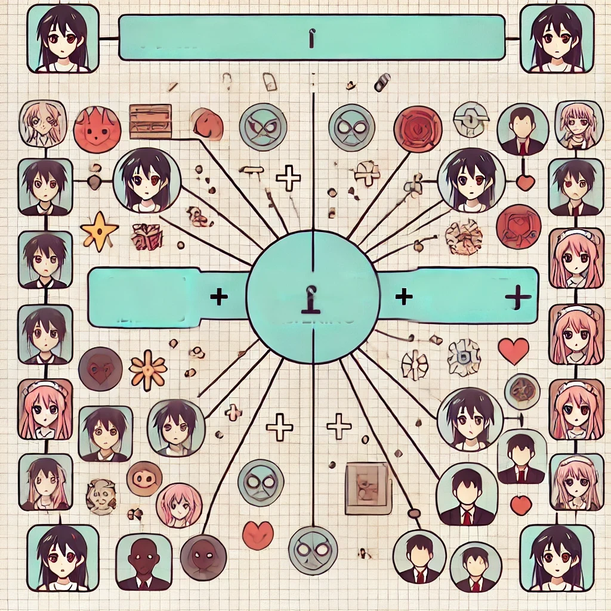

# Laporan Penelitian Sistem Rekomendasi pada Anime - Muhammad Rafly Arjasubrata
Muhammad Rafly Arjasubrata

## Project Overview

### Latar Belakang
Rekomendasi anime telah menjadi aspek penting dalam platform streaming dan komunitas anime online. Dengan jumlah anime yang terus berkembang, menemukan anime yang sesuai dengan preferensi user semakin menantang. Sistem rekomendasi yang efektif dapat membantu user menemukan konten yang mereka sukai, meningkatkan kepuasan user, dan keterlibatan dalam platform.

[](./asset/header.webp)

### Urgensi Penelitian
Penelitian ini penting karena membantu dalam mengembangkan sistem rekomendasi yang dapat meningkatkan pengalaman user dengan memberikan rekomendasi anime yang relevan dan personal. Dengan menggunakan pendekatan kombinasi **Collaborative Filtering** dan **Content-Based Filtering**, sistem ini dapat memberikan rekomendasi yang lebih akurat dan komprehensif, bahkan ketika data user terbatas.

## Business Understanding

### Problem Statements

- Bagaimana cara membangun model sistem rekomendasi yang dapat menemukan anime yang sesuai dengan rating yang diberikan oleh seorang user ?
- Bagaimana membangun model sistem rekomendasi yang mampu mengutamakan fitur-fitur tertentu dari anime, seperti genre, jumlah episode, atau popularitasnya ?
- Bagaimana membangun sistem rekomendasi yang efektif untuk user baru yang belum memiliki banyak rating atau interaksi dengan anime ?

### Goals

- Mengembangkan model sistem rekomendasi yang mampu memberikan rekomendasi anime yang relevan dan akurat berdasarkan rating yang telah diberikan oleh user.
- Membangun sistem rekomendasi yang dapat memprioritaskan fitur-fitur tertentu dalam proses pemberian rekomendasi, sehingga rekomendasi lebih sesuai dengan preferensi konten spesifik user.
- Merancang sistem rekomendasi yang efektif untuk user baru, dengan fokus pada memberikan rekomendasi yang relevan meskipun data interaksi atau rating masih terbatas.

### Solution Statement
- **Collaborative Filtering**. Model ini akan digunakan untuk menemukan kesamaan antara user berdasarkan rating yang diberikan, sehingga dapat merekomendasikan anime yang disukai oleh user dengan preferensi serupa.
- **Pembobotan Prediksi pada Collaborative Filtering**. Menerapkan pembobotan dalam Collaborative Filtering untuk meningkatkan akurasi rekomendasi. Bobot diberikan berdasarkan faktor seperti popularitas anime dan kepercayaan pada rating user, sehingga model dapat memberikan rekomendasi yang lebih relevan dan personal.
- **Content Based Filtering**. Pendekatan ini akan fokus pada fitur-fitur spesifik dari anime, seperti genre, jumlah episode, dan rating untuk memberikan rekomendasi yang sesuai dengan preferensi konten yang diutamakan oleh user.

## Data Understanding
Untuk mendukung pembuatan solusi yang diusulkan dalam **Solution Statement**, beberapa dataset diperlukan. Berikut adalah penjelasan tentang data yang dibutuhkan, serta peran dan fungsinya dalam membangun model sistem rekomendasi.

### Dataset Yang Digunakan
Sumber : <a href='https://www.kaggle.com/datasets/CooperUnion/anime-recommendations-database'>Link Kaggle</a>

Dataset "Anime Recommendations Database" berisi preferensi dari 73,516 user terhadap 12,294 anime berbeda yang terdiri dari dua file CSV: anime.csv dan rating.csv. File anime.csv berisi daftar judul anime dengan atribut seperti genre, tipe, jumlah episode, rating, dan jumlah anggota. Sementara itu, rating.csv berisi data penilaian pengguna terhadap berbagai anime, yang dapat digunakan untuk membangun sistem rekomendasi berbasis kolaboratif. Dataset ini cocok untuk mengembangkan dan menguji model rekomendasi anime.

#### `anime.csv`
|Baris|Kolom|
|-----|-----|
|12294|7    |

| anime_id | anime_title              | genre             | type | episodes | rating | members |
|----------|--------------------------|-------------------|------|----------|--------|---------|
| 1        | Cowboy Bebop              | Action, Adventure | TV   | 26       | 8.77   | 200000  |
| 2        | Fullmetal Alchemist       | Action, Fantasy   | TV   | 51       | 8.55   | 350000  |
| 3        | Steins;Gate               | Sci-Fi, Thriller  | TV   | 24       | 9.11   | 450000  |
| 4        | Attack on Titan           | Action, Drama     | TV   | 25       | 8.49   | 600000  |
| 5        | Death Note                | Mystery, Police   | TV   | 37       | 8.63   | 700000  |


Dataset **anime** adalah kumpulan data yang berisi informasi mendetail tentang bagaimana anime yang digunakan dalam sistem rekomendasi. Dataset ini mencakup beberapa kolom pentiig yang masing-masing memiliki peran khusus dala memahami dan menganalisis konten anime. Berikut adalah penjelasan dari setiap kolom dalam dataset anime.

1. `anime_id` <br>
Kolom ini berisi ID unik untuk setiap anime. ID ini digunakan sebagai pengenal utama yang menghubungkan data anie dengan data rating user dalam sistem rekomendasi. Dengan ini, sistem dapat secara efisien mengakses dan mengelola data terkait setiap anime

2. `name` <br>
Kolom ini mencantumkan judul resmi dari setiap anime. Judul anime digunakan untuk menampilkan hasil rekomendasi kepada user dan juga berfungsi sebagai referensi utama dalam pemrosesan data, seperti saat melakukan pembersihan judul atau ketika sistem mencari kesamaan antar anime.

3. `genre` <br>
Kolom ini berisi daftar genre yang terkait dengan setiap anime. Satu anime dapat memiliki lebih dari satu genre. Genre sangat penting dalam Content-Based Filtering karena membantu sistem mengidentifikasi anime yang memiliki konten serupa berdasarkan kategori atau tema yang sama.

4. `type` <br>
Kolom ini mencantumkan tipe dari setiap anime seperti **TV** atau **OVA**. Tipe anime membantu dalam mengkategorikan anime berdasarkan format penyiarannya, yang dapat memengaruhi cara user menikmati konten dan dapat digunakan dalam pembobotan rekomendasi.

5. `episodes` <br>
Kolom ini menunjukkan jumlah episode dari setiap anime. Jumlah episode sering digunakan untuk memahami skala dan durasi anime, serta untuk mengelompokkan aniem ke dalam kategori seperti **'short'** atau **'long'** yang kemudian digunakan dalam model rekomendasi.

6. `rating` <br>
Kolom ini berisi nilai rating rata-rata yang diberikan oleh user untuk setiap anime. Rating ini mencerminkan kualitas dari anime di mata user dan sangat berpengaruh dalam Collaborative Filtering, di mana rating digunakan untuk mengukur kesamaan preferensi antar user.

7. `members` <br>
Kolom ini menunjukkan jumlah anggota yang telah menambahkan anime tersebut ke dalam daftar mereka. Jumlah anggota adalah indikator popularitas anime dan sering digunakan dalam pembobotan untuk memberikan preferensi lebih kepada anime yang lebih populer.

#### `rating.csv`

|Baris|Kolom|
|-----|-----|
|7813737|3    |

| user_id | anime_id | rating |
|---------|----------|--------|
| 5       | 67       | 6      |
| 5       | 68       | 6      |
| 5       | 132      | 6      |
| 5       | 136      | 8      |
| 5       | 137      | 8      |

Dataset **rating** adalah kumpulan data yang mencatat interaksi user dengan berbagai anime dalam bentuk penilaian atau rating yang diberikan. Dataset ini memainkan peran penting dalam membangun model **Collaborative Filtering**, yang bertujuan untuk merekomendasikan anime kepada user berdasarkan pola rating dari user lain yang memiliki preferensi serupa. Berikut adalah penjelasan dari setiap kolom dalam dataset rating :

1. `user_id` <br>
Kolom ini berisi ID unik yang mewakili setiap user dalam dataset. ID ini digunakan untuk mengidentifikasi user individu dan menghubungkan preferensi mereka dengan rating yang diberikan. Dalam model rekomendasi, kolom ini memungkinkan sistem untuk melacak preferensi spesifik user dan membandingkannya dengan user lain.

2. `anime_id` <br>
Kolom ini berisi ID unik untuk setiap anime yang dirating oleh user. ID ini menghubungkan dataset rating dengan datast anime, memungkinkan sistem untuk mengakses informasi detail tentang anime yang dinilai, seperti genre, jumlah episode, dan rating rata-rata.

3. `rating` <br>
Kolom ini menunjukkan nilai rating yang diberikan oleh user terhadap anime tertentu biasanya dalam skala (1-10). Rating ini mencerminkan penilaian nuser terhadap kualitas atau kesukaan mereka terhadp anime tersebut.

### Exploratory Data Analysis
EDA adalah langkah awal yang penting dalam pengembangan sistem rekomendasi. EDA dilakukan untuk memahami karakteristik dasar dari data seperti distribusi rating, jumlah episode, dan genre. Dengan melakukan EDA, pola-pola penting dapat diidentifikasi. Selain itu, EDA juga dilakukan untuk mendeteksi missing values, outliers, atau data yang tidak konsisten yang dapat memengaruhi akurasi rekomendasi. EDA juga bermanfaat untuk memvalidasi asumsi awal tentang data, seperti kecenderungan user memberikan rating tinggi untuk anime yang mereka sukai, sehingga model yang dihasilkan lebih efektif dan efisien.

#### **`Penggabungan Data Rating User Terhadap Anime yang Dirating`**
Penggabungan ini dilakukan untuk mengaitkan informasi dari kedua dataset. Langkah ini memungkinkan analisis yang lebih mendalam seperti melihat hubungan antara genre dan rating, serta mempersiapkan data untuk model rekomendasi yang efektif.

Berikut adalah contoh DataFrame yang sudah digabungkan
|anime_id|anime_title|genre|type|episodes|rating|members|user_id|rating_user|
|--------|-----------|-----|----|--------|------|-------|-------|-----------|
32281|Kimi no Na wa.|Drama, Romance, School, Supernatural|Movie|1.0|9.37|200630|99|5|
32281|Kimi no Na wa.|Drama, Romance, School, Supernatural|Movie|1.0|9.37|200630|152|10|
32281|Kimi no Na wa.|Drama, Romance, School, Supernatural|Movie|1.0|9.37|200630|244|10|
32281|Kimi no Na wa.|Drama, Romance, School, Supernatural|Movie|1.0|9.37|200630|271|10|
32281|Kimi no Na wa.|Drama, Romance, School, Supernatural|Movie|1.0|9.37|200630|278|-1|

Ukuran table setelah penggabungan adalah `[7813727, 9]`

#### **`Top 5 Anime Berdasarkan Banyaknya Rating`**

[](./asset/top5rating.png)

Barchart di atas menunjukkan anime jumlah rating tertinggi. Hal ini mengindikasikan anime yang populer dan disukai oleh kalangan user. Informasi ini dapat digunakan sebagai dasar rekomendasi bagi user baru, khususnya mereka yang belum memiliki history menonton maupun history rating. Dengan demikian sistem rekomendasi dapat memberikan saran awal yang menarik dan relevan berdasarkan anime yang disukai di kalangan user.

#### **`Top 5 Anime Berdasarkan Jumlah Anggota Komunitas`**

[](./asset/top5komunitas.png)

Anime seperti **Death Note**, **Shingeki no Kyojin**, dan **Sword Art Online** menempati posisi tertinggi juga pada jumlah komunitas. Hal tersebut mengindikasikan bahwa anime yang memiliki jumlah rating yang tinggi juga cenderung memiliki komunitas user yang besar. Dengan memanfaatkan data popularitas berdasarkan rating dan jumlah anggota komunitas, sistem rekomendasi dapat memberikan saran yang lebih akurat dan relevan bagi user.

#### **`Distribusi Nilai Rating`**

Terdapat dua rating yang terdapat pada DataFrame gabungan, yaitu **Rating Website** dan **Rating User**.

**Rating Website** mengacu pada rating rata-rata yang diberikan oleh seluruh user untuk sebuah anime tertentu. Rating ini merupakan agregat dari semua rating individu yang diterima oleh anime tersebut dan memberikan gambaran umum tentang seberapa baik anime tersebut diterima komunitas secara keseluruhan.

**Rating User** merujuk pada rating yang diberikan oleh user terhadap anime tertentu. Data ini lebih spesifik dan mencerminkan preferensi suatu user.

[](./asset/distribusirating.png)

**Rating Website** cenderung terpusat pada nilai 6 hingga 9, dengan puncak sekitar 7 dan 8. Ini menunjukkan bahwa anime secara umum dinilai cukup baik oleh user di seluruh komunitas, dengan sebagian besar mendapatkan penilaian rata-rata yang cukup tinggi. Sedangkan **Rating User** cenderung banyak yang menilai pada jangka 8 hingga 10. Hal ini dapat mencerminkan bahwa hanya anime dengan kualitas tertentu yang menarik cukup perhatian untuk dinilai secara luas.

Nilai -1 yang cukup banyak menunjukkan jumlah signifikan user yang menambahkan anime ke daftar mereka tanpa memberikan rating. Ini mengindikasikan bahwa banyak user yang telah berinteraksi dengan anime tersebut tetapi memilih untuk tidak memberkan rating. 

Jumlah rating yang menonjol pada nilai yang tinggi dapat disebabkan oleh positive bias yang menyebabkan kecenderungan untuk memberikan nikai sangat tinggi dan efek popularitas anime tersebut yang memberikan motivasi kepada sesama user untuk memberikan rating yang tinggi.

#### **`Korelasi Antara Rating Anime dan Jumlah Membernya`**

[](./asset/korelasiratingmember.png)

Scatterplot di atas menunjukkan bahwa tidak ada korelasi linear yang kuat antara rating dan jumlah member. Meskipun anime dengan jumlah anggota yang banyak cenderung memiliki rating yang cukup baik, popularitas anime tidak selalu berbanding lurus dengan ratingnya. Ini mengindikasikan bahwa **terdapat faktor lain yang menentukan popularitas anime, selain dari rating yang diterima**

#### **`Persebaran Format Distribusi Anime`**

[](./asset/persebaranformatdistribusi.png)

Persebaran pada distribusi format seperti **TV**, **OVA**, dan **Movie** menunjukkan bahwa user memiliki preferensi dalam menikmati konten anime. Oleh karena itu, sistem rekomendasi harus lebih fleksibel dan mampu memberikan rekomendasi yang bervariasi berdasarkan preferensi user terhadap berbagai format distribusi.

#### **`Persebaran Jumlah Episode`**

[](./asset/persebaranepisode.png)

Dari histogram jumlah episode anime, terlihat bahwa mayoritas anime memiliki jumlah episode yang sedikit, dengan puncak pada rentang 0 hingga 50. Ini menunjukkan bahwa sebagian besar anime dibuat dalam format pendek. Hanya sedikit anime yang memiliki lebih dari 100 episode. Distribusi ini mengindikasikan bahwa format munsim pendek sangat umum, dengan banyak serial yang dibuat dalam 12-13 episode (satu musim pendek) atau 24-26 episode (dua musim pendek).

Informasi ini penting karena menunjukkan perlunya memprioritaskan rekomendasi anime pendek yang lebih mungkin disukai oleh user yang mencari tontonan cepat. Namun, tetap penting untuk menyertakan beberapa rekomendasi anime panjang untuk user yang menikmati cerita mendalam.

#### **`Persebaran Jumlah Rating yang Diberikan User`**

[](./asset/persebaranratingdiberikan.png)

Dari histogram di atas, terlihat jelas bahwa partisipasi userdalam memberikan rating sangat bervariasi, tetapi mayoritas cenderung memberikan hanya sedikit rating. Ini dapat berarti bahwa meskipun basis user besar, kontribusi mereka dalam penilaian mungkin terbatas. Dengan banyak penggun amasih memberikan sedikit rating, ini menciptakan masalah sparsity dalam data, yang dapat mempengaruhi akurasi model rekomendasi.

#### **`Persebaran Jumlah Rating oleh User yang Diterima Anime`**

[](./asset/persebaranratingditerima.png)

Dari histogram di atas, terlihat jelas bahwa popularitas anime sangat bervariasi, tetapi mayoritas anime cenderung menerima sedikit rating. Ini dapat berarti bahwa meskipun ada banyak anime yang tersedia, hanya beberapa yang benar-benar populer di kalangan user. Hal ini juga menciptakan masalah sparsity dalam data, yang dapat mempengaruhi akurasi model.

#### **`Kesimpulan Akhir EDA`**

Dari analisis EDA yang dilakukan, beberapa kesimpulan penting dapat diambil terkait distribusi dan preferensi user terhadap anime: 

1. **Distribusi Format Anime** <br>
**TV** Merupakan format anime yang paling populer ($30.2\%$), yang kemudian diikuti oleh **OVA** ($27.4\%$), **Movie** ($19.1\%$), dan **Speecial** ($14.1\%$). Format lain memiliki presentase yang lebih kecil. Ini menunjukkan bahwa `meskipun TV tetap populer, ada diversifikasi yang signifikan dalam cara anime didistribusikan`.

2. **Distribusi Jumlah Episode** <br>
Mayoritas anime memiliki jumlah episode yang relatif sedikit, dengan puncak pada rentang 0 hingga 50 episode. Hanya sedikit anime yang memiliki lebih dari 100 episode (159 anime), hal ini menunjukkan bahwa `format musim pendek sangat umum dalam industri anime`.

3. **Rating Website dan Rating User** <br>
**Rating website** cenderung terpusat pada nilai 6 hingga 9, dengan puncak sekitar 7 dan 8. Ini menunjukkan bahwa anime secara umum dinilai cukup baik oleh user di seluruh komunitas, dengan sebagian besar mendapatkan rating rata-rata yang cukup tinggi. Sedangkan **rating user** cenderung banyak yang menilai pada nilai 8 hingga 10. Hal ini dapat mencerminkan bahwa `hanya anime dengan kualitas tertentu yang menarik cukup perhatian untuk dinilai secara luas.

4. **Persebaran Rating yang Diberikan** <br>
Terlihat jelas bahwa partisipasi user dalam memberikan rating dan popularitas anime sangat bervariasi, tetapi mayoritas user dan anime cenderung menerima sedikit rating. Ini mengindikasikan bahwa meskipun basis user besar dan banyak anime yang tersedia, kontribusi user dalam memberikan rating mungkin terbatas dan hanya beberapa anime yang benar-benar populer saja yang mendapatkan rating dari user itu sendiri. `Dengan banyaknya user dan anime yang menerima sedikit rating, ini menciptakan masalah sparsity dalam data, yang dapat mempengaruhi akurasi model rekomendasi. 

## Data Preprocessing

### Data Preprocessing untuk **Collaborative Filtering**
Dalam **Collaborative Filtering**, format dat yang digunakan adalah matrix user-anime, dimana setiap baris mewakili user dan kolom mewakili anime dengan value di dalam matriks menunjukkan rating yang diberikan oleh user tersebut.

Terdapat beberapa langkah data preprocessing untuk mengonversi data mentah untuk memastikan integritas dan keakuratan data dan membuat format matrix user-anime. Berikut adalah langkah-langkah yang dilakukan dalam data preprocessing untuk Collaborative Filtering:

1. **Penghapusan Rating tidak Valid** <br>
user yang tidak melakukan rating akan dihapus karena data tersebut tidak berarti dalam Collaborative Filtering yang akan dibangun dan akan menyebabkan meningkatnya noise dan tingkat komputasi yang dibutuhkan. Penghapusan dilakukan dengan melihat nilai kolom rating pada `rating.csv`. Jika nilai rating -1, maka data akan dihapus.

<div style="display: flex;" align='center'>
<div style="flex: 25%; padding: 10px;">
</div>
<div style="flex: 25%; padding: 10px;">
    Sebelum penghapusan rating tidak valid
    <table>
        <tr><th>user_id</th><th>anime_id</th><th>rating</th></tr>
        <tr><td>5</td><td>67</td><td>7</td></tr>
        <tr><td>5</td><td>68</td><td>9</td>
        </tr><tr><td>5</td><td>132</td><td>-1</td></tr>
        <tr><td>5</td><td>136</td><td>-1</td></tr>
        <tr><td>5</td><td>137</td><td>6</td></tr>
    </table>
</div>
<div style="flex: 25%; padding: 10px;">
    Setelah penghapusan rating tidak valid
    <table>
        <tr><th>user_id</th><th>anime_id</th><th>rating</th></tr>
        <tr><td>5</td><td>67</td><td>7</td></tr>
        <tr><td>5</td><td>68</td><td>9</td>
        <tr><td>5</td><td>137</td><td>6</td></tr>
    </table>
</div>
<div style="flex: 25%; padding: 10px;">
</div>
</div>

2. **Penghapusan Data Duplikat** <br>
Baris data yang duplikat hanya menambahkan bias dimana seolah-olah ada duat data atau lebih user yang berbeda memberikan suatu rating, namun nyatanya data tersebut hanya merepresentasikan satu user saja.

3. **Penggabungan Data Anime dan Rating** <br>
Penggabungan dilakukan untuk integrasi aniem dan user ke dalam satu DataFrame. Dengan menggabungkan data anime dan user, suatu anime dapat melihat bagaimana anime tersebtu dirating oleh berbagai user dan suatu user dapat melihat kemiripan dengan user lain. <br>
Berikut adalah tabel setelah penggabungan 

    <div align='center'>
    <table border="1" cellpadding="10">
    <thead>
        <tr><th>anime_id</th><th>anime_title</th><th>genre</th><th>type</th><th>episodes</th><th>rating</th><th>members</th><th>user_id</th><th>rating_user</th></tr>
    </thead>
    <tbody>
        <tr><td>5114</td><td>Fullmetal Alchemist: Brotherhood</td><td>Action, Adventure, Drama, Fantasy, Magic, Military, Shounen</td><td>TV</td><td>64.0</td><td>9.26</td><td>793665</td><td>3</td><td>10</td></tr>
        <tr><td>5114</td><td>Fullmetal Alchemist: Brotherhood</td><td>Action, Adventure, Drama, Fantasy, Magic, Military, Shounen</td><td>TV</td><td>64.0</td><td>9.26</td><td>793665</td><td>11</td><td>8</td></tr>
        <tr><td>5114</td><td>Fullmetal Alchemist: Brotherhood</td><td>Action, Adventure, Drama, Fantasy, Magic, Military, Shounen</td><td>TV</td><td>64.0</td><td>9.26</td><td>793665</td><td>12</td><td>9</td></tr>
        <tr><td>5114</td><td>Fullmetal Alchemist: Brotherhood</td><td>Action, Adventure, Drama, Fantasy, Magic, Military, Shounen</td><td>TV</td><td>64.0</td><td>9.26</td><td>793665</td><td>17</td><td>10</td></tr>
        <tr><td>5114</td><td>Fullmetal Alchemist: Brotherhood</td><td>Action, Adventure, Drama, Fantasy, Magic, Military, Shounen</td><td>TV</td><td>64.0</td><td>9.26</td><td>793665</td><td>19</td><td>9</td></tr>
    </tbody>
    </table>
    </div>

### Data Preprocessing untuk **Content-Based Filtering**

Model **Content-Based Filtering** memerlukan data yang deskriptif tentang item yang direkomendasikan. Dalam konteks anime, model ini akan merekomendasikan anime kepada user bedasarkan kesamaan antara anime yang telah dinikmati oleh user dan karakteristik dari anime lainnya. Oleh karena itu, dilakukan pengolahan pada data untuk membuat data anime yang dapat diterima oleh model content-based yang dibuat. Berikut adalah preprocessing yang dilakukan.

1. **Membersihkan Judul Anime** <br>
Judul anime sering kali memiliki tanda baca, spasi tambahan, atau kata-kata yang tidak relevan untuk dijadikan fitur. Membersihkan judul dari hal tersebut dapat dilakukan dengan bantuan RegEx, dimana `akan diterapkan beberapa pola RegEx pada setiap judul anime pada data`. Berikut adalah contoh judul anime sebelum dan sesudah pembersihan

    |Sebelum Cleaning|Sesudah Cleaning|
    |----------------|----------------|
    |Gintama'|Gintama|
    |Steins;Gate: OVA|Steins Gate|
    |Fullmetal Alchemist: Brotherhood|Fullmetal Alchemist Brotherhood|
    |Naruto: Shippuden Movie 6 - Road to Ninja|Naruto Shippuden Road to Ninja|

    Hasil diatas menunjukkan bahwa proses **text cleaning** berhasil menghilangkan karakter dan menghilangkan kata yang tidak relevan. Dengan menghilangkan elemen-elemen tersebut, judul anime lebih sederhana

    Berikut adalah pola pembersihan yang dilakukan.
    ```python
    cleanPattern = {
        r'&quot;': '', # Menghapus entitas HTML untuk tanda kutip
        r'.hack//': '', # Menghapus pola .hack//
        r'&#039;': "'", # Mengubah entitas HTML untuk tanda kutip tunggal
        r'&amp;': 'and', # Mengubah entitas HTML untuk tanda '&'
        r'\s+': ' ', # Menghapus spasi ekstra
        r'\s*:\s*': ': ', # Menyusun ulang spasi sebelum dan sesudah tanda titik dua
        r'\s*-+\s*': ' - ', # Menyusun ulang spasi sebelum dan sesudah tanda hubung
        r'\s*\(\w+\)\s*': '', # Menghapus teks dalam tanda kurung 
        r'\s*movie\s*\d*': '', # Menghapus teks "movie" dan angka setelahnya
        r'\s*ova\s*\d*': '', # Menghapus teks "OVA" dan angka setelahnya
        r'\'s\b': '', # Menghapus possessive 's
        r'\W+': ' ', # Menghapus karakter non-alfabet
    }
    ```

2. **Penghapusan Nilai NULL** <br>
Penghilangan data yang memiliki nilai NULL dilakukan untuk memastikan data yang digunakan dalam analisis atau model tidak mengandung kekosongan yang bisa menyebabkan error atau bias dalam hasil.

    `Baris pada data yang memiliki nilai NULL dihapus`

3. **Filtering Berdasarkan Nilai Rating** <br>
Filtering pada rating dilakukan untuk memastikan bahwa rekomendasi yang dilakukan memberikan kualitas anime yang tinggi dan disukai oleh user. Filtering ini membantu meningkatkan relevansi hasil dengan mengecualikan anime yang dianggap kurang baik.

    `Filtering dilakukan dengan menghapus anime dengan nilai rating dibawah 5`

4. **Filtering Berdasarkan Jumlah member** <br>
Filter ini bertujuan untuk mempertahankan anime yang memiliki jumlah member tertentu untuk memastikan bahwa rekomendasi yang diberikan difokuskan pada anime yang lebih populer dan memiliki basis member yang cukup.

    `Anime dengan member kurang dari 100 dihapus`

5. **Normalisasi Genre** <br>
Normalisasi genre dilakukan untuk menyelaraskan konsistensi antara genre. Proses in `mencakup penghapusan koma dan pengubahan menjadi lowercase`. Normalisasi ini membantu menyatukan variasi penulisan genre sehingga lebih seragam.

    Berikut adalah contoh Genre sebelum dan sesudah normalisasi
    |Sebelum Normalisasi|Sesudah Normalisasi|
    |-------------------|-------------------|
    |Drama, Romance, School, Supernatural|drama romance school supernatural|
    |Sci-fi, Thriller|sci-fi thriller|
    |Action, Comedy, Historical|action comedy historical|

6. **Normalisasi Tipe** <br>
Kolom tipe `diubah ke dalam lowercase` agar konsisten dengan seluruh fitur pada anime yang akan dibuat.

7. **Pengkategorian Episode, Rating dan Member** <br>
Pengkategorisasian bertujuan untuk mengubah nilai numerik dari jumlah episode menjadi kategori yang lebih bermakna. Ini penting dilakukan karena model yang dibangun bekerja lebih efektif untuk memproses teks atau kategori daripada nilai numerik mentah. Dengan mengkategorisasikan jumlah episode, informasi tersebut menjadi lebih relevan dan memungkinkan membandingkan kesamaan antara anime berdasrkan kategori tertentu. berikut adalah kategorisasi yang dilakukan

    <div style="display: flex;" align='center'>
    <div style="flex: 33%; padding: 10px;">
        <b>Kategorisasi Episode</b>
        <table>
            <tr><th>range</th><th>kategori</th></tr>
            <tr><td>1</td><td>movie</td></tr>
            <tr><td>>= 2 & <= 6</td><td>ova ona</td></tr>
            <tr><td>>= 7 & <= 12</td><td>short</td></tr>
            <tr><td>>= 13 & <= 26</td><td>medium</td></tr>
            <tr><td>>= 27 & <= 50</td><td>long</td></tr>
            <tr><td>>50</td><td>marathon</td></tr>
        </table>
    </div>
    <div style="flex: 33%; padding: 10px;">
        <b>Kategorisasi Rating</b>
        <table>
            <tr><th>range</th><th>kategori</th></tr>
            <tr><td>0</td><td>no rating</td></tr>
            <tr><td>>= 1 & < 5</td><td>bad</td></tr>
            <tr><td>>= 5 & < 7</td><td>mid</td></tr>
            <tr><td>>= 7 & < 8.5</td><td>good</td></tr>
            <tr><td>>= 8.5 & <= 10</td><td>excellent</td></tr>
        </table>
    </div>
    <div style="flex: 33%; padding: 10px;">
        <b>Kategorisasi Member</b>
        <table>
            <tr><th>range</th><th>kategori</th></tr>
            <tr><td><= 1000</td><td>no rating</td></tr>
            <tr><td>> 1000 & <= 10000</td><td>bad</td></tr>
            <tr><td>>10000 & <= 50000</td><td>mid</td></tr>
            <tr><td>> 50000 & <= 100000</td><td>good</td></tr>
            <tr><td>> 100000</td><td>excellent</td></tr>
        </table>
    </div>
    </div>

8. **Penggabungan Data** <br>
Penggabungan data bertujuan untuk menggabungkan berbagai fitur dari anime seperti judul, genre, kategori episode, dll menjadi satu teks yang komprehensif. Penggabungan ini penting untuk membuat satu kolom fitur yang memiliki seluruh informasi terkait suatu anime, yang kemudian dapat digunakan dalam model content based untuk menganalisis kesamaan antar anime.

    Dengan menggabungkan data dari berbagai aspek, model dapat mempertimbangkan semua karakteristik penting secara bersamaan, sehingga informasi menghasilkan rekomendasi yang lebih akurat dan relevan. Penggabungan data ini membantu memastikan bahwa semua informasi anime tetap dipertimbangkan dalam penetuan rekomendasi.

    | Anime Description |
    | ----------------------------------------------------------------------------------------------------------------------|
    | kimi no na wa  drama romance school supernatural movie excellent famous                                              |
    | fullmetal alchemist brotherhood action adventure drama fantasy magic military shounen marathon excellent famous      |
    | gintama  action comedy historical parody samurai sci-fi shounen marathon excellent famous                            |
    | steins gate sci-fi thriller medium excellent famous                                                                  |
    | gintama  action comedy historical parody samurai sci-fi shounen marathon excellent famous                            |


## Modeling
Terdapat beberapa model yang dibuat baik untuk Collaborative Filtering maupun Content-Based Filtering. Pembuatan beberapa model dilakukan untuk mengevaluasi dan mencari model terbaik.

```
Karena keterbatasan komputasi, hanya 1,000,000 data diambil pada data rating
```

### Data Latih dan Data Uji
Pembagian data menjadi data latih dan data uji bertujuan untuk mengevaluasi kinerja model secara objektif dan mencegah overfitting. **Data Latih** digunakan untuk melatih model sehingga dapat mengenali pola dan hubungan dalam data, sedangkan data uji digunakan untuk menguji model yang telah dilatih untuk menilai performa dan generalisasi model tersebut.

Data uji yang digunakan sebesar $1\%$ dari keseluruhan data (dari 1,000,000 data), mengingat banyaknya jumlah data dan terdapat masalah keterbatasan komputasi saat melakukan pengujian.

### Model Collaborative Filtering
Collaborative Filtering adalah teknik dalam sistem rekomendasi yang menggunakan pola perilaku dan preferensi user untuk memprediksi anime yang mungkin disukai oleh user lain. Teknik ini memanfaatkan data rating yang diberikan user pada berbagai anime untuk menemukan kesamaan dalam preferensi dan memberikan rekomendasi yang relevan.

#### **Kelebihan Collaborative Filtering** <br>
1. **Personalisasi yang Tinggi**. Memberikan rekomendasi yang sangat dipersonalisasi berdasarkan preferensi user.
2. **Tidak Memerlukan Data Eksternal**. Hanya membutuhkan data interaksi user dengan anime, tidak perlu informasi tambahant erkait anime atau user itu sendiri.
3. **Adaptif**. Dapat menyesuaikan dengan perubahan preferensi user dari waktu ke waktu.

#### **Kekurangan Collaborative Filtering** <br>
1. **Masalah Data Sparsity**. Matriks user-anime sering kali sangat besar dan jarang terisi, hal ini dapat menyebabkan kebutuhan tingkat komputasi yang tinggi.
2. **Cold Start Problem**. Sulit memberikan rekomendasi akurat untuk user baru atau anime baru yang belum banyak memiliki rating. 
3. **Scalability**. Mengelola dan menghitung kesamaan dalam dataset besar dapat membutuhkan tingkat komputasi yang tinggi.

#### Data Yang Digunakan
Kolom `user_id` digunakan untuk mengidentifikasi suatu user, sedangkan `anime_id` mengidentifikasi suatu anime, dan `rating_user` menyediakan informasi tentang penilaian user terhadap suatu anime. Informasi ini cukup untuk membentuk matrix user-anime atau pivot table yang menjadi dasar model. Kolom lain seperti genre atau jumlah episode tidak diperlukan karena pada Collaborative Filtering berfokus pada pola kesamaan antara user dengan user lain.

Berikut adalah contoh tabel data yang digunakan
|user_id|anime_id|rating_user|
|-------|--------|-----------|
|3|5113|10|
|11|5113|9|
|12|5113|8|
|17|5113|7|
|19|5113|9|

### Pivot Table
Dalam collaborative Filtering, pivot table digunakan untuk menyusun informasi user dan anime dalam format matriks, dimana baris mewakili anime dan kolom mewakili user. Nilai dalam pivot table ini adalah rating yang diberikan user terhadap itemtersebut, dimana 0 berarti user belum memberikan rating terhadap anime tersebut.

**Tujuan Pivot Table**
1. **Struktur Data yang Jelas**. Mengorganisasi data sehingga hubungan antara anime dan user menjadi jelas.
2. **Kemudahan Perhitungan**. Mempermudah perhitungan kesamaan antara user karena dapat direpresentasikan menjadi vektor.

Terdapat **dua pivot table** yang akan dibuat, yaitu :

`allPivot` yang merupakan pivot table yang dibuat dari seluruh data rating user. Ini digunakan untuk memastikan bahwa semua informasi rating tersedia dan digunakan untuk memprediksi dalam model rekomendasi.

`trainPivot` yang merupakan table yang dibuat dari data latih. Ini digunakan untuk melatih model rekomendasi, sehingga model dapat menanganin pola-pola dalam data rating yang ada. Dengan memisahkan data latih, kinerja model dapat diukur secara objektif.

Berikut adalah contoh pivot table yang dibuat, dimana $x$ adalah `user_id `dan $y$ adalah `anime_id`

| |3|5|7|8|11|...|121|122|123|
|-|-|-|-|-|--|---|---|---|---|
|**1**|0|0|3|4|1|...|9|10|8|
|**5**|10|0|2|8|0|...|0|4|0|
|**9**|0|7|0|0|3|...|10|7|0|

Pivot table yang dibuat memiliki ukuran **(4565 $\times$ 7756)**

### Compressed Sparse Row (CSR)
CSR adalah format penyimpanan matriks yang digunakan untuk menyimpan sparse matrix secara efisien dalam memori. CSR terdiri dari tiga komponen utama, yaitu :
1. **Data**. Merupakan array satu dimensi yang berisi semua elemen nol dari matriks
2. **Indices**. Array satu dimensi yang berisi indeks kolom untuk setiap elemen dalam array data
3. **Index Pointer**. Array satu dimensi yang berisi indek sdalam array data yang memulai setiap baris dari matriks.

Format CSR digunakan oleh `SciKit-Learn Nearest Neighbor` sebagai input data latih. Ini memungkinkan model untuk memanfaatkan struktur data yang lebih ringan dan lebih cepat dibandingkan pivot table.

#### `Model dengan Euclidean Distance`
Model dengan **Euclidean Distance** adalah metode dimana kesamaan antar user dihitung menggunakan metric Euclidean. Ini mengukur jarak garis lurus antara dua titik. dengan ini, Euclidean Distance digunakan untuk mengukur seberapa mirip dua user atau anime berdasarkan rating yang diberikan. Semakin kecil jarak Euclidean, semakin mirip user tersebut terhadap user lain. Jika dua user memberikan rating yang mirip, amaka jarak Euclidean antara mereka akan kecil. Berdasarkan ini, sistem rekomendasi dapat merekomendasikan anime yang disukai oleh satu user terhadap user lainnya.

**Cara Kerja Eulidean Distance**
1. **Menghitung Jarak Euclidean** <br>
Jarak Euclidean antara vektor rating user dihitung untuk menentukan kemiripan mereka. Semakin kecil jaraknya, semakin mirip preferensi user tersebut.
2. **Menemukan User Serupa** <br>
User yang memiliki jarak euclidean yang kecil mengidikasikan kemiripan antara dua user tersebut. Semakin kecil jaraknya, semakin mirip preferensi user tersebut
3. **Memberikan Rekomendasi** <br>
Setelah menemukan user yang mirip, sistem memberikan rekomendasi berdasarkan anime yang diberi rating tinggi oleh user serupa yang belum pernah dirating oleh user target.

**Hasil Rekomendasi Yang Diberikan Untuk `user_id = 5`**
<div style="display: flex;" align='center'>
<div style="flex: 50%; padding: 10px;">
<b>Hasil Rekomendasi</b><br>
Dari Model Euclidean
    <table>
        <tr><th>anime_title</th><th>predicted_rating</th></tr>
        <tr><td>Cowboy Bebop: Tengoku no Tobira	</td><td>8.40</td></tr>
        <tr><td>FLCL</td><td>8.18</td></tr>
        <tr><td>Trigun</td><td>8.00</td></tr>
        <tr><td>Akira</td><td>8.00</td></tr>
        <tr><td>Samurai Champloo</td><td>7.33</td></tr>
    </table>
</div>
<div style="flex: 50%; padding: 10px;">
<b>Top 5 Rating Oleh User</b> <br>
Sebagai Referensi
    <table>
        <tr><th>anime_title</th><th>rating_user</th></tr>
        <tr><td>Gintama Movie: Kanketsu-hen - Yorozuya yo Eien...</td><td>10</td></tr>
        <tr><td>Great Teacher Onizuka</td><td>10</td></tr>
        <tr><td>Steins;Gate	</td><td>9</td></tr>
        <tr><td>Gintama&#039;</td><td>9</td></tr>
        <tr><td>Gintama</td><td>9</td></tr>
    </table>
</div>
</div>

#### `Model dengan Cosine Simlarity`
Model Collaborative Filtering dengan **Cosine Similarity **adalah metode dimana kesamaan antar user dihitung menggunakan metrik sudut cosine. Cosine Similarity mengukur kesamaan antara dua vektor dengan menghitung cosinus dari sudut di antara mereka. Ini sering digunakan karena mengabaikan magnitudo dan hanya mengabaikan pertimbangan orientasi, yang berguna dalam mengukur kesamaan pola rating meskipun skalanya berbeda.

Jika dua user memberikan rating yang memiliki pola serupa (suka tau tidak suka anime yang sama), maka Cosine Similarity antara mereka akan tinggi, menandakan bahwa preferensi mereka serupa. Berdasarkan ini, sistem rekomendasi dapat merekomendasikan anime yang disukai oleh suatu user kepada user lainnya.

**Cara kerja Cosine Similarity**
1. **Menghitung nilai Similarity** <br>
Cosine Similarity antara A dan B dihitung, dimana vektor rating dari dua user akan memiliki range hasil -1 hingga 1. Nilai -1 berarti kedua user memiliki preferensi yang berlawanan, sedangkan nilai 0 berarti kedua user tidak memiliki kesamaan sama sekali, dan 1 berarti kedua user memiliki preferensi yang sama.
2. **Menemukan User Serupa** <br>
User dengan nilai Cosine Similarity tertinggi dianggap sebagai yang paling mirip. Model `Scikit-Learn NearestNeighbor` digunakan untuk menemukan user serupa berdasarkan nilai cosine.
3. **Memberikan Rekomendasi** <br>
Setelah menemukan user yang memiliki pola yang serupa, sistem akan memberikan rekomendasi anime kepada user target bedarsarkan item yang dirating tinggi oleh user tersebut. Item yang belum ditonton oleh user target namun memiliki rating tinggi dari user serupa akan direkomendasikan.

**Hasil Rekomendasi Yang Diberikan Untuk `user_id = 5`**
<div style="display: flex;" align='center'>
<div style="flex: 50%; padding: 10px;">
<b>Hasil Rekomendasi</b><br>
Dari Model Cosine Similarity
    <table>
        <tr><th>anime_title</th><th>predicted_rating</th></tr>
        <tr><td>Cowboy Bebop: Tengoku no Tobira</td><td>8.40</td></tr>
        <tr><td>FLCL</td><td>8.18</td></tr>
        <tr><td>Trigun</td><td>8.00</td></tr>
        <tr><td>Samurai Champloo</td><td>7.33</td></tr>
        <tr><td>Neon Genesis Evangelion</td><td>4.50</td></tr>
    </table>
</div>
<div style="flex: 50%; padding: 10px;">
<b>Top 5 Rating Oleh User</b> <br>
Sebagai Referensi
    <table>
        <tr><th>anime_title</th><th>rating_given</th></tr>
        <tr><td>Gintama Movie: Kanketsu-hen - Yorozuya yo Eien...</td><td>10</td></tr>
        <tr><td>Great Teacher Onizuka</td><td>10</td></tr>
        <tr><td>Steins;Gate</td><td>9</td></tr>
        <tr><td>Gintama&#039;</td><td>9</td></tr>
        <tr><td>Gintama</td><td>9</td></tr>
    </table>
</div>
</div>

#### `Fine Tuning Model dengan Weighted Euclidean Distance`
**Fine Tuning dengan Weight** dalam sistem rekomendasi bertujuan untuk menyesuaikan weight pada berbagai aspek seperti genre, tipe, dan jumlah episode guna meningkatkan akurasi dan relevansi rekomendasi yang diberikan. Model **Euclidean Distance** dipilih untuk dilakukan fine tune karena `Model Euclidean Distance memiliki hasil yang lebih baik dibandingkan model Cosine Similarity`. Relevansi untuk digunakan weight adalah karena genre mungkin memiliki pengaruh besar karena user cenderung memiliki preferensi genre tertentu. Oleh karena itu, memberikan weight lebih tinggi pada genre dapat meningkatkan kualitas rekomendasi. Berikut adalah data faktor dari weight yang diberikan:

1. **Genre** <br>
Banyak user yang memiliki preferensi kuat terhadap genre tertentu, sehingga memberikan weight pada genre dapat meningkatkan relvansi rekomendasi. Genre juga mencerminkan tema dengan gaya umum dari anime, yang merupakan faktor utama yang memengaruhi apakah seorang user akan menyukai anime tersebut atau tidak.
2. **Type** <br>
Tipe anime juga merupakan faktor penting karena berbeda tipe anime menawarkan pengalaman menonton yang berbeda. Misalnya user mungkin lebih menyukai anime dengan format TV yang memiliki episode berkelanjutan, atau lebih menyukai Movie karena durasinya lebih singkat dan cerita yang padat. Dengan memberikan weight pada tipe, sistem rekomendasi dapat menyesuaikan rekomendasi untuk lebih mencocokkan format anime dengan preferensi user.
3. **Episodes** <br>
Jumlah episode dapat memengaruhi daya tarik suatu anime. Beberapa user lebih menyukai anime dengan episode singkat karena lebih mudah untuk diikuti, sementara yang lain mungkin lebih tertarik pada anime dengan banyak episode karena memberikan cerita yang lebih mendalam dan pengembangan karakter yang lebih luas.

**Pengaruh Weight dalam Hasil Rekomendasi** cukup signifikan. Weight yang diterapkan pada aspek-aspek tertentu dapat mengubah prioritas rekomendasi yang diberikan oleh sistem, Selain itu, finetuning weight dapat memungkinkan sistem untuk menyesuaikan rekomendasi berdasarkan tren dan preferensi yang sedang berkembang.

**Weight yang Diberikan**
    <div style="display: flex;" align='center'>
    <div style="flex: 33%; padding: 10px;">
        <b>Weight Genre</b>
        <table>
            <tr><th>Genre</th><th>Weight</th></tr>
            <tr><td>Action</td><td>1.35</td></tr>
            <tr><td>Adventure</td><td>1.3</td></tr>
            <tr><td>Comedy</td><td>1.25</td></tr>
            <tr><td>Drama</td><td>1.1</td></tr>
            <tr><td>Fantasy</td><td>1</td></tr>
            <tr><td>Romance</td><td>0.95</td></tr>
            <tr><td>Sci-Fi</td><td>0.9</td></tr>
            <tr><td>Slice of Life</td><td>0.875</td></tr>
            <tr><td>Horror</td><td>0.85</td></tr>
            <tr><td>Mystery</td><td>0.825</td></tr>
        </table>
    </div>
    <div style="flex: 33%; padding: 10px;">
        <b>Weight Type</b>
        <table>
            <tr><th>Type</th><th>Weight</th></tr>
            <tr><td>TV</td><td>1.2</td></tr>
            <tr><td>Movie</td><td>1.15</td></tr>
            <tr><td>OVA</td><td>1.05</td></tr>
            <tr><td>Special</td><td>1</td></tr>
            <tr><td>ONA</td><td>0.95</td></tr>
            <tr><td>Music</td><td>0.9</td></tr>
        </table>
    </div>
    <div style="flex: 33%; padding: 10px;">
        <b>Weight Episode</b>
        <table>
            <tr><th>Episodes</th><th>Weight</th></tr>
            <tr><td>> 0 * <= 12</td><td>0.95</td></tr>
            <tr><td>> 12 & <= 24</td><td>1.1</td></tr>
            <tr><td>> 24 & <= 50</td><td>0.9</td></tr>
            <tr><td>> 50 & <= 100</td><td>0.85</td></tr>
            <tr><td>Lainnya</td><td>0.825</td></tr>
        </table>
    </div>
    </div>

Kemudian setiap weight tersebut dikalikan dengan faktor tertentu untuk mengatur seberapa pengaruh setiap kategori. Berikut adalah parameter faktor yang akan diujikan dengan metode **Grid Search**

|Faktor Genre|Faktor Type|Faktor Episodes|
|------------|-----------|---------------|
|0.15|1.65|0.875|
|0.2|1.7|1.75|
|0.25|1.75|0.825|

**Hasil Rekomendasi Weighted Euclidean Distance**

**Hasil Rekomendasi Yang Diberikan Untuk `user_id = 5`**
<div style="display: flex;" align='center'>
<div style="flex: 50%; padding: 10px;">
<b>Hasil Rekomendasi</b><br>
Dari Model Weighted Euclidean Distance
    <table>
        <tr><th>anime_title</th><th>predicted_rating</th></tr>
        <tr><td>Cowboy Bebop: Tengoku no Tobira</td><td>8.32</td></tr>
        <tr><td>Trigun</td><td>8.17</td></tr>
        <tr><td>Akira</td><td>7.89</td></tr>
        <tr><td>FLCL</td><td>7.53</td></tr>
        <tr><td>Samurai Champloo</td><td>6.98</td></tr>
    </table>
</div>
<div style="flex: 50%; padding: 10px;">
<b>Hasil Rekomendasi tanpa Weight</b> <br>
Sebagai Referensi
    <table>
        <tr><th>anime_title</th><th>predicted_rating</th></tr>
        <tr><td>Cowboy Bebop: Tengoku no Tobira</td><td>8.40</td></tr>
        <tr><td>FLCL</td><td>8.18</td></tr>
        <tr><td>Trigun</td><td>8.00</td></tr>
        <tr><td>Akira</td><td>8.00</td></tr>
        <tr><td>Samurai Champloo</td><td>7.33</td></tr>
    </table>
</div>
</div>


#### **Skema Pengujian**

Mean Absolute Error (MAE) akan digunakan sebagai metrik evaluasi utama untuk mengukur performa dari sistem rekomendasi Collaborative Filtering. MAE mengukur seberapa besar rata-rata kesalahan antara rating yang diprediksi oleh model dan rating yang sebenarnya diberikan oleh user. Semakin rendah nilai MAE, semakin baik kinerja model dalam memberikan rekomendasi. MAE memberikan gambaran sederhana namun efektif tentang akurasi prediksi model. `Model terbaik akan dipilih berdasarkan MAE terkecil`

#### Evaluasi Model Collaborative Filtering

Berikut adalah hasil nilai MAE pada model **Euclidean Distance** dan **Cosine Similarity**.

|Euclidean Distance|Cosine Similarity|
|------------------|-----------------|
|**0.37376**       |0.44519          |

Berdasarkan hasil pengujian, model **Collaborative Filtering** yang menggunakan `Euclidean Distance` menunjukkan kinerja yang lebih baik dibandingkan dengan model yang menggunakan Cosine Similarity. Hasil MAE yang lebih rendah pada model Euclidean Distance mengindikasikan bahwa prediksi model ini lebih mendekati rating aktual yang diberikan oleh user, sehingga model ini lebih akurat dalam memberikan rekomendasi.

**Euclidean Distance** lebih efektif dibandingkan **Cosine Similarity** dalam Collaborative Filtering pada kasus ini karena Euclidean Distance lebih sensitif terhadap perbedaan skala rating yang diberikan oleh user. Pada dataset ini, user mungkin memiliki skala penilaiain yang lebih konsisten, sehingga perbedaan kecil dalam skala lebih signifikan dalam mempengaruhi rekomendasi. Dengan demikian, Euclidean Distance berhasil meanangkap perbedaan kecil dalam rating, yang ternyata lebih relevan dalam memprediksi preferensi user dibandingkan hanya mengukur kesamaan pola atau orientasi rating seperti yang dilakukan Cosine Similarity.

Berikut adalah hasil grid search nilai MAE pada model **Weighted Euclidean Distance**.

<div style="display: flex;" align='center'>
<div style="flex: 33%; padding: 10px;">
    <table>
        <tr><th>Genre</th><th>Type</th><th>Episodes</th><th>MAE</th></tr>
        <tr><td>0.15</td><td>1.75</td><td>0.875</td><td>0.3750</td></tr>
        <tr><td>0.15</td><td>1.75</td><td>0.900</td><td>0.3802</td></tr>
        <tr><td>0.15</td><td>1.75</td><td>0.825</td><td>0.4006</td></tr>
        <tr><td>0.15</td><td>1.70</td><td>0.900</td><td>0.3924</td></tr>
        <tr><td>0.15</td><td>1.70</td><td>0.875</td><td>0.4148</td></tr>
        <tr><td>0.15</td><td>1.70</td><td>0.825</td><td>0.4712</td></tr>
        <tr><td>0.15</td><td>1.65</td><td>0.875</td><td>0.4887</td></tr>
        <tr><td>0.15</td><td>1.65</td><td>0.900</td><td>0.4586</td></tr>
        <tr><td>0.15</td><td>1.65</td><td>0.825</td><td>0.5646</td></tr>
    </table>
</div>
<div style="flex: 33%; padding: 10px;">
    <table>
        <tr><th>Genre</th><th>Type</th><th>Episodes</th><th>MAE</th></tr>
        <tr><td>0.20</td><td>1.70</td><td>0.900</td><td>0.3794</td></tr>
        <tr><td>0.20</td><td>1.75</td><td>0.825</td><td>0.3804</td></tr>
        <tr><td>0.20</td><td>1.70</td><td>0.875</td><td>0.3877</td></tr>
        <tr><td>0.20</td><td>1.75</td><td>0.875</td><td>0.3883</td></tr>
        <tr><td>0.20</td><td>1.75</td><td>0.900</td><td>0.4070</td></tr>
        <tr><td>0.20</td><td>1.65</td><td>0.900</td><td>0.4184</td></tr>
        <tr><td>0.20</td><td>1.70</td><td>0.825</td><td>0.4289</td></tr>
        <tr><td>0.20</td><td>1.65</td><td>0.875</td><td>0.4445</td></tr>
        <tr><td>0.20</td><td>1.65</td><td>0.825</td><td>0.5070</td></tr>
    </table>
</div>
<div style="flex: 33%; padding: 10px;">
    <table>
        <tr><th>Genre</th><th>Type</th><th>Episodes</th><th>MAE</th></tr>
        <tr><td>0.25</td><td>1.70</td><td>0.875</td><td>0.3838</td></tr>
        <tr><td>0.25</td><td>1.75</td><td>0.825</td><td>0.3857</td></tr>
        <tr><td>0.25</td><td>1.70</td><td>0.900</td><td>0.3917</td></tr>
        <tr><td>0.25</td><td>1.65</td><td>0.900</td><td>0.3942</td></tr>
        <tr><td>0.25</td><td>1.70</td><td>0.825</td><td>0.3996</td></tr>
        <tr><td>0.25</td><td>1.65</td><td>0.875</td><td>0.4104</td></tr>
        <tr><td>0.25</td><td>1.75</td><td>0.875</td><td>0.4193</td></tr>
        <tr><td>0.25</td><td>1.75</td><td>0.900</td><td>0.4450</td></tr>
        <tr><td>0.25</td><td>1.65</td><td>0.825</td><td>0.4605</td></tr>
    </table>
</div>
</div>


Dari hasil **Grid Search** diatas dapat dilihat bahwa weight berpengaruh terhadap performa model rekomendasi. Berdasarkan EDA yang sudah dilakukan, weight diberikan kepada **genre**, **type** dan, **episodes** tertentu dimana setiap kateogri diberikan weight tertentu berdasarkan nilai kategori tersebut. Rasio 0.15:1.75:0.875 untuk genre:type:episodes memiliki nilai MAE terkecil. Hal tersebut menandakan bahwa preferensi user cenderung memiliki preferensi terhadap tipe tertentu.

#### Kesimpulan pada Model Collaborative Filtering
Secara keseluruhan, evaluasi menunjukkan bahwa **Collaborative Filtering** dengan menggunakan **Euclidean Distance** dan **Fine Tuning dengan Weight** adalah pendekatan yang sangat efektif untuk memberikan rekomendasi anime yang akurat dan relevan. Model ini berhasil menangkap kesamaan antar user dengan mempertimbangkan jarak dalam skala rating mereka. Melalui pendekatan ini, perbedaan kecil dalam rating dapat diidentifikasi, sehingga suer dengan preferensi serupa dapat saling memberikan rekomendasi.

Implementasi akhir dari model ini dapat menjadi dasar untuk pengembangan lebih lanjut, termasuk menggunakan **Collaborative Filtering** dengan **Content-Based Filtering** untuk mengatasi keterbatasan masing-masing pendekatan dan memberikan hasil yang lebih akurat.

### Model Content Based Filtering
**Content-Based Filtering** adalah metode dalam sistem rekomendasi yang memberikan rekomendasi kepada user berdasarkan konten antar item yang dipilih. Metode ini menggunakan fitur dari anime seperti judul, genre, jumlah episode, dan lain-lain untuk menemukan anime yang mirip satu sama laiun.

Content-Based Filtering bekerja dengan menganalisis fitur konten dan kemudian merekomendasikan anime yang memiliki karakteristik serupa dengan anime yang diberikan. Metode ini tidak bergantung pada data user lain, sehingga tetap bisa memberikan rekomendasi yang relevan meskipun data user terbatas.

#### Term Frequency - Inverse Document Frequency (TF-IDF)
TF-IDF adalah teknik yang digunakan untuk mengukur seberapa penting sebuah kata dalam deskripsi anime tertentu. Teknik ini membantu model memahami kata-kata mana yang paling relevan dan membedakan suatu anime dari anime yang lain. Algoritma TF-IDF dibagi menjadi dua bagian:

1. **Term Frequency (TF)** <br>
Bagian ini bertanggung jawab untuk menghitung seberapa sering sebuah kata muncul dalam deskripsi atau fitur dari suatu anime. Misalnya, genre tertentu sering muncul dalam deskripsi anime Naruto, maka nilai TF untuk ninja akan tinggi untuk anime Naruto.

2. **Inverse Document Frequency (IDF)** <br>
Ini menghitung seberapa unik atau jarang sebuah kata muncul di seluruh dataset anime. Kata-kata umum seperti 'the' atau 'is' akan memiliki IDF yang rendah karena muncul di hampir semua deskripsi, sedangkan kata-kata seperti 'jutsu' mungkin memiliki IDF yang tinggi karena lebih spesifik untuk anime tertentu.

Dengan menggunakan TF-IDF, model bisa membedakan antara anime berdasarkan fitur-fitur yang penting dan unik. Misalnya, jika seorang user menyukai anime dengan genre **Action** dan tema **Ninja**, TF-IDF akan membantu mengidentifikasi anime lain yang juga memiliki fokus kuat pada tema tersebut. Setelah TF-IDF menghitung skor untuk setiap kata dalam suatu deskripsi anime, model dapat membandingkan anime satu dengan yang lain berdasarkan kesamaan kata-kata penting, bukan hanya berdasarkan kemunculannya saja. Ini membuat rekomendasi lebih relevan.

**Parameter dalam `TfidfVectorizer` dari Scikit-Learn**
Object TfidfVectorizer digunakan untuk membuat matriks TF-IDF dari data deskripsi anime. Berikut adalah penjelasan parameter yang digunakan dalam objek tersebut.

- `min_df` <br>
Parameter ini menentukan batas bawah frekuensi dokumen untukmemasukkan kata-kata dalam model. Kata-kata yang muncul di lebih sedikit dokumen akan diabaikan.
- `max_features` <br>
Parameter ini menentukan jumlah maksimum kata yang dipertimbangkan oleh model. Skor n tertinggi yang akan dipertahankan. Jumlah n dapat diatur untuk mengontrol ukuran model dan mencegah overfitting dengan membatasi jumlah kata yang dipertimbangkan.

- `strip_accents` <br>
Parameter ini digunakan untuk menghilangkan aksen dari karakter dalam teks yang berguna untuk meminimalkan perbedaan antar kata yang seharusnya sama (caf dan cafe).

- `analyzer` <br>
Analyzer menentukan level yang akan digunakan untuk menganalisis teks, yaitu apakah ingin menganalisis berdasarkan karakter, atau kata. Dengan mengatur parameter ini, fleksibilitas untuk menyesuaikan analisis dengan kebutuhan spesifik, seperti memfokuskan kata pada kata atau sub-bagian kata.

- `token_pattern` <br>
Parameter ini adalah RegEx yang digunakan untuk menentukan pola token yang akan diambil dari teks. Parmeter ini mengatur bagaimana teks dibagi menjadi token yang dapat membantu mengangani kata khusus atau simbol. Parameter yang digunakan adalah `\w{1,}` yang berarti pola RegEx tersebut akan mencocokkan setiap kata terdiri dari satu kata atau lebih karakter alfanumerik, tanpa memfilter kata-kata yang sangat pendek.

- `ngram_range` <br>
Ini adalah parameter yang menentukan panjang n-gram yang akan dipertimbangkan. N-gram adalah rangkaian berurutan dari n-item, di mana item bisa berupa kata atau karakter. Parameter yang digunakan adalah `(1,3)`, ini berarti model akan mempertimbangkan urutan kata tunggal (unigram), dua kata berurutan (bigram), dan tiga kata berurutan(trigram).

- `stop_wrods` <br>
Stop Words adalah daftar kata yang diabaikan dalam proses pemodelan, biasanya karena kata-kata tersebut terlalu umum dan tidak memberikan banyak informasi.

Berikut adalah parameter yang digunakan
```python
# Inisialisasi Object TF-IDF Vectorizer dari sklearn
tfV = TfidfVectorizer(
    min_df=2,
    max_features=1000,
    strip_accents='unicode',
    analyzer='word',
    token_pattern=r'\w{1,}',
    ngram_range=(1, 3),
    stop_words='english'
)
```

Berikut adalah contoh matrix TF-IDF yang sudah dibuat

| |0|1|action|comedy|2nd|2nd season|pokemon|pokemon pikachu|...|
|-|-|-|------|------|---|----------|-------|---------------|---|
|0|0.0|0.127|0.0|0.0|0.0|0.0|0.0|0.0|0.0|
|1|0.0|0.0|0.0|0.0|0.0|0.0|0.0|0.0|0.0|
|2|0.0|0.0|0.0|0.0|0.068|0.0|0.0|0.0|0.0|
|3|0.0|0.0|0.0|0.0|0.0|0.0|0.0|0.23|0.0|

#### `Model dengan Kernel Linear`
Kernel linear digunakan untuk menghitung kesamaan antara data dengan mengukur **Dot Product** dari vektor-vektor fitur dalam ruang linear. Kernel ini mengukur kesamaan langsung dalam matrix TF-IDF antara dua anime berdasarkan representasi fitur mereka.

**Hasil Prediksi Kernel Linear pada Anime `Pokemon: The Origin`**

|anime_title|
|-----------|
|Pokemon XY: Mega Evolution|
|Pokemon XY&amp;Z Specials|
|Pokemon Advanced Generation|
|Pokemon: Pikachu no Fuyuyasumi|
|okemon: Pikachu no Fuyuyasumi (2000)|

#### `Model dengan Kernel Sigmoid`
Kernel sigmoid memperkenalkan non-linearitas dalam perhitungan kesamaan antar dua anime. Kernel sigmoid menggunakan fungsi sigmoid untuk menghitung kesamaan antara dua vektor fitur. Ini sedang digunakan dalam item yang mungkin tidak terlihat jelas dalam ruang linear.

**Hasil Prediksi Kernel Sigmoid pada Anime `Pokemon: The Origin`**

|anime_title|
|-----------|
|Pokemon XY: Mega Evolution|
|Pokemon XY&amp;Z Specials|
|Pokemon Advanced Generation|
|Pokemon: Pikachu no Fuyuyasumi|
|okemon: Pikachu no Fuyuyasumi (2000)|

#### Evaluasi Model Content-Based Filtering
Dapat dilihat bahwa hasil rekomendasi model dengan menggunakan kernel **linear** dan **sigmoid** memberikan hasil rekomendasi yang sama. Ini menunjukkan bahwa hubungan antara fitur-fitur dalam data cukup linear dan sederhana sehingga kedua kernel menangkap pola yang serupa. Dalam kasus ini, penggunaan kernel yang lebih kompleks seperti sigmoid tidak memberikan keuntungan tambahan dibandingkan kernel linear.

#### Kesimpulan Content-Based Filtering
Model yang dibuat berhasil mengimplementasikan sistem rekomendasi **Content-Based Filtering** untuk anime dengan menggunakan TF-IDF untuk mengubah fitur seperti judul, genre, jumlah episode, rating, dan jumlah anggota menjadi representasi vektor.

Hasil akhir model yang dibuat menunjukkan bahwa sistem rekomendasi yang dibangun dapat memberikan saran anime yang relevan berdasarkan konten yang mirip dengan anime yang disukai user. Hasil rekomendasi dari kedua kernel yang sama mengindikasikan bahwa hubungan antar fitur cukup linear dan sederhana. Sistem ini menunjukkan potensi yang baik dalam memberikan rekomendasi yang relevan dan bisa dioptimalkan lebih lanjut lagi dengan menguji model langsung pada user.

## Kesimpulan Akhir

Berdasarkan hasil pengujian yang dilakukan, kesimpulan akhir dari penelitian ini adalah:

1. **Collaborative Filtering** <br>
**Euclidean Distance** terbukti lebih efektif dibandingkan Cosine Similarity dalam sistem rekomendasi anime, hal tersebut ditunjukkan dengan nilai MAE yang lebih rendah. Model Euclidean Distance lebih sensitif terhadap perbedaan kecil dalam skala rating yang diberikan user, sehingga memberikan prediksi yang lebih akurat dan lebih mendekati rating aktual. Hal ini menunjukkan bahwa pada dataset ini, preferensi user mungkin lebih seragam, membuat model Euclidean Distance lebih relevan.

2. **Model Weighted Euclidean Distance** <br>
Hasil dari **Grid Search** menunjukkan bahwa pembobotan fitur genre, tipe, dan jumlah episode sangat mempengaruhi performa model. Pembobotan dengan rasio 0.15:1.75:0.875 (genre:type:episodes) menghasilkan MAE terkecil, mengindikasikan bahwa preferensi user cenderung lebih dipengaruhi oleh tipe anime tertentu. Ini menunjukkan bahwa penyesuaian weight pada fitur tertentu dapat meingkatkan akurasi rekomendasi dengan lebih baik menangkap preferensi spesifik user.

3. **Content-Based Filtering** <br>
Hasil analisis menunjukkan bahwa model dengan kernel **linear** dan **sigmoid** memberikan rekomendasi yang sama. Ini menandakan bahwa hubungan antar fitur dalam data cukup linear, sehingga model dengan kernel linear sudah mampu mengangkap pola yang ada seara efektif. Penggunaan kernel yang lebih kompleks seperti sigmoid tidak memberikan peningkatan performa yang signifikan pada kasus ini.

Dengan menggabungkan kedua pendekatan ini, sistem rekomendasi menjadi lebih robust dan adaptif. **Collaborative Filtering** memberikan rekomendasi yang dipersonalisasi berdasarkan perilaku dan preferensi user lain, sementara **Content-Based Filtering** memastikan bahwa rekomendasi tetap relevan bahkan jika data user terbatas, dengan fokus pada kesamaan konten. Kerja sama antara kedua sistem ini memungkinkan pembuatan rekomendasi yang lebih holistik, menangkap preferensi user dari berbagai sudut pandang dan memberikan pengalaman user yang lebih kaya dan memuaskan.
